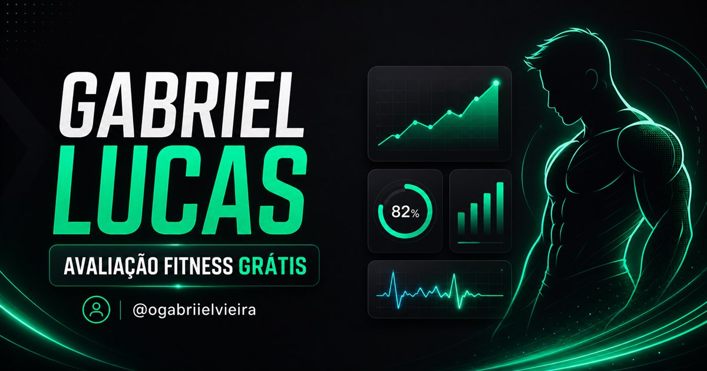

# ⚡ BioLink Fitness — Gabriel Lucas

BioLink responsiva para avaliação fitness, ferramentas de treino, localização de academias Pratique Fitness, materiais gratuitos e contato com a consultoria online.

🔗 **Produção:** [biofit-consultoria.vercel.app](https://biofit-consultoria.vercel.app)  
📸 **Instagram:** [@ogabriielvieira](https://instagram.com/ogabriielvieira)

<p align="center">
  
</p>

## ✨ Destaques

- Layout adaptado para celulares, tablets, notebooks e monitores grandes.
- Visual em duas áreas no desktop e navegação vertical no celular.
- Componentes carregados sob demanda para reduzir o carregamento inicial.
- Prévia personalizada para compartilhamento no WhatsApp e redes sociais.
- Navegação acessível por teclado e interface otimizada para toque.
- Funcionamento client-side, sem necessidade de banco de dados para as ferramentas fitness.

## 📊 Central Fitness

A Central Fitness reúne uma avaliação completa e ferramentas rápidas:

### Avaliação em quatro etapas

- Dados básicos e sexo utilizado no cálculo metabólico.
- Peso e altura.
- Nível de atividade e frequência semanal de treino.
- Objetivo e peso-meta.

### Resultado da avaliação

- IMC e classificação corporal.
- Taxa Metabólica Basal (TMB).
- Gasto Energético Diário Total (TDEE).
- Meta calórica estimada.
- Proteínas, carboidratos, gorduras e fibras.
- Referência diária de água e passos.
- Faixa de peso baseada no IMC.
- Distribuição estimada das calorias por refeição.
- Orientações gerais conforme o objetivo.
- Seleção automática de ilustração corporal para homem ou mulher em seis faixas de IMC.

> Os resultados são estimativas educativas para adultos e não substituem avaliação médica, nutricional ou acompanhamento individualizado.

### Ferramentas rápidas

- 💧 Estimativa de água diária.
- 🏃 Cálculo de ritmo de corrida e velocidade média.
- 🏋️ Estimativa de carga máxima (1RM).
- 🔄 Troca de alimentos por equivalência aproximada de calorias.

## 📱 Cartão para Stories

O resultado pode ser transformado em um cartão no formato **1080 × 1920 px**:

- Exibe IMC, objetivo, calorias, macros e hidratação.
- Inclui automaticamente a ilustração correspondente ao sexo e à faixa de IMC.
- Permite escolher uma foto pessoal diretamente do celular.
- A foto é processada somente na memória temporária do navegador.
- Nenhuma foto é enviada ou armazenada em servidor.
- Permite compartilhar pelo menu nativo do aparelho ou baixar em PNG.
- Inclui a identificação `@ogabriielvieira`.

## 📍 Academias Pratique Fitness

- Base com **154 unidades** e coordenadas revisadas.
- Pesquisa por nome, endereço e região.
- Filtros de modalidades disponíveis.
- Visualização das unidades no mapa.
- Localização opcional para encontrar as três academias mais próximas.
- Abertura de rota diretamente no Google Maps.

A localização é solicitada somente quando o usuário escolhe procurar academias próximas.

## 📚 E-books e materiais

- E-book de doces proteicos e fit.
- E-book de receitas salgadas.
- Conteúdos de treino e hipertrofia.
- PDFs personalizados com o nome informado pelo usuário.
- Geração vetorial com `@react-pdf/renderer`.

O mecanismo de PDF é baixado apenas quando o usuário solicita um material, evitando aumentar o carregamento inicial da página.

## 💬 Consultoria e contato

- Comparação de planos de consultoria.
- Mensagens personalizadas enviadas ao WhatsApp.
- Links oficiais para Instagram, WhatsApp e e-mail.
- Área de edição local disponível em `/editar`.
- Importação e exportação das configurações em JSON.

As alterações realizadas no editor ficam armazenadas no navegador utilizado.

## 🛠️ Tecnologias

- React 18
- TypeScript
- Vite
- CSS responsivo
- React Icons e Lucide React
- Canvas API para os cartões de Stories
- Geolocation API para unidades próximas
- `@react-pdf/renderer` para PDFs
- `canvas-confetti` para efeitos visuais
- Vercel para hospedagem e rotas SPA

## 📁 Estrutura principal

```text
src/
├── components/       Componentes da BioLink, modais, mapa e Central Fitness
├── data/             Configuração, receitas e unidades Pratique Fitness
├── image/            Perfil e ilustrações corporais de IMC
├── types/            Tipos TypeScript
└── utils/            Cálculos fitness, PDFs e cartão de Stories

public/
├── favicon.svg
└── og-preview.jpg    Imagem de compartilhamento social

scripts/
├── auditGoogleMaps.mjs
└── geocodeAddresses.mjs
```

## 💻 Executando localmente

Requisitos:

- Node.js 18 ou superior.
- npm.

```bash
git clone https://github.com/DevGabriel0402/biolink-gabriellucas.git
cd biolink-gabriellucas
npm install
npm run dev
```

Por padrão, o servidor de desenvolvimento utiliza `http://localhost:3005`.

## 📦 Compilação de produção

```bash
npm run build
npm run preview
```

Os arquivos finais serão gerados em `dist/`.

## 🚀 Publicação na Vercel

O projeto inclui o arquivo `vercel.json`, que direciona as rotas da aplicação para `index.html`.

Passos básicos:

1. Conectar o repositório à Vercel.
2. Selecionar Vite como framework.
3. Utilizar `npm run build` como comando de build.
4. Utilizar `dist` como diretório de saída.

## 🔐 Privacidade

- A avaliação não exige cadastro.
- Os dados informados nas calculadoras não são enviados para servidor.
- A foto opcional do Story não é armazenada.
- A localização é usada somente para calcular as unidades próximas.
- Personalizações feitas em `/editar` utilizam o armazenamento local do navegador.

## 📬 Contatos

- **Responsável:** Gabriel Lucas
- **WhatsApp:** [(31) 99166-0594](https://wa.me/5531991660594)
- **Instagram:** [@ogabriielvieira](https://instagram.com/ogabriielvieira)
- **E-mail:** [gabriellucas2301@gmail.com](mailto:gabriellucas2301@gmail.com)

---

Desenvolvido para a consultoria fitness de Gabriel Lucas.
