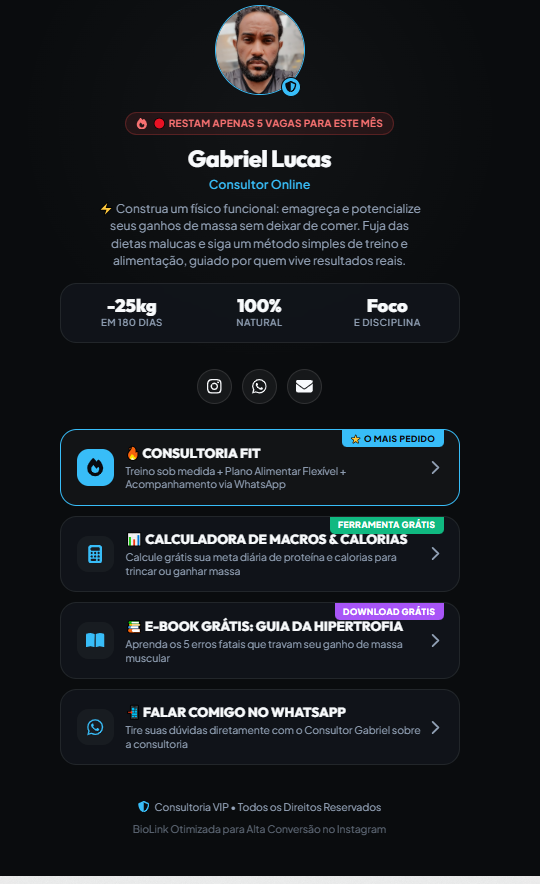

# ⚡ BioLink Premium - Consultor Gabriel Lucas

> **Aplicação Web Client-Side de Alta Performance para Personal Trainer & Consultoria Fitness Online.**  
> 🔗 **Aplicação em Produção:** [https://biofit-consultoria.vercel.app](https://biofit-consultoria.vercel.app)

---

## 📱 Visualização da Interface (BioLink Gabriel Lucas)

<p align="center">
  
</p>

---

## 🚀 Principais Funcionalidades

### 📊 1. Calculadora de Macros, Calorias & IMC Interativa
- **Cálculo da Taxa Metabólica Basal (TMB)**: Quantidade mínima de calorias em repouso.
- **Gasto Calórico Total Diário (TDEE)**: Ajuste com base na frequência de treinos.
- **Ajuste Estratégico**: Déficit Calórico para secar gordura ou Superávit para hipertrofia.
- **Ilustrações Corporais Dinâmicas**: Troca automática de imagens corporais para **Homens** e **Mulheres** conforme a faixa de IMC.
- **Mensagem Persuasiva por IMC**: Orientação personalizada e gatilho de ação direto para o WhatsApp.

### 📚 2. Geração Nátiva de E-books em PDF (`@react-pdf/renderer`)
- **E-book 20 Doces Proteicos & Fit**: 20 sobremesas anabólicas com tabela completa de macros.
- **E-book 20 Receitas Salgadas & Anabólicas**: Opções práticas para a dieta diária.
- **E-book Guia da Hipertrofia Acelerada**: Dicas definitivas de treino e nutrição.
- **Geração Vetorial Instantânea**: Download direto no navegador em PDF HD sem perda de nitidez ou quebras de página indesejadas.

### 💎 3. Comparador de Planos de Consultoria VIP
- Exibição hierárquica completa dos planos: **Mensal**, **Trimestral** e **Semestral**.
- Envio de ficha de inscrição formatada diretamente para o WhatsApp do Consultor Gabriel.

### ⚡ 4. Painel de Edição ao Vivo (`/editar`)
- Permite editar foto de perfil, links, preços dos planos, estatísticas e botões em tempo real.
- Exportação e importação instantânea de configurações em formato JSON.

---

## 🛠️ Tecnologias Utilizadas

- **Core**: React 18, TypeScript, Vite
- **Estilização**: Vanilla CSS com variáveis de tema Dark Onyx & Efeitos Glassmorphism
- **PDF Engine**: `@react-pdf/renderer` (Gerador nativo vetorial)
- **Ícones**: `react-icons` (FontAwesome 6, Heroicons 2, Feather Icons)
- **Efeitos**: `canvas-confetti`
- **Deploy & SPA Rewrite**: Vercel (`vercel.json`)

---

## 📬 Contatos Oficiais & Suporte

- **Consultor Responsável:** Gabriel Lucas
- **🌐 Aplicação Web:** [https://biofit-consultoria.vercel.app](https://biofit-consultoria.vercel.app)
- **📲 WhatsApp Direct:** [(31) 99166-0594](https://wa.me/5531991660594)
- **📸 Instagram:** [@ogabriielvieira](https://instagram.com/ogabriielvieira)
- **✉️ E-mail da BioLink:** [gabriellucas2301@gmail.com](mailto:gabriellucas2301@gmail.com)

---

## 💻 Como Rodar o Projeto Localmente

```bash
# 1. Clonar o repositório
git clone https://github.com/DevGabriel0402/biolink-gabriellucas.git

# 2. Entrar na pasta do projeto
cd biolink-gabriellucas

# 3. Instalar as dependências
npm install

# 4. Iniciar o servidor de desenvolvimento
npm run dev
```

---

## 📦 Build para Produção

```bash
npm run build
```

---

*Desenvolvido com excelência para a Consultoria Fitness do Consultor Gabriel Lucas.*
